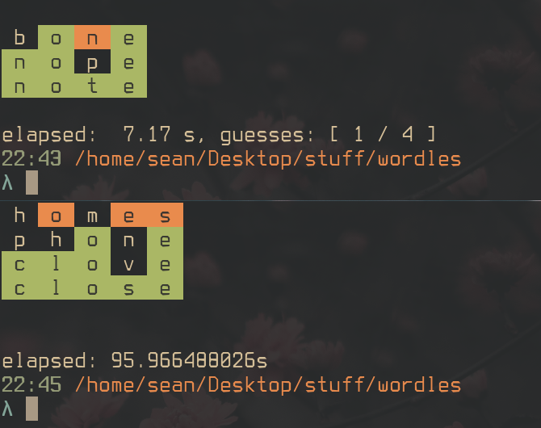

cli [wordle](https://www.nytimes.com/games/wordle/index.html) clone in various languages for fun

|lang| version|
|----|:--------|
|Rust| 1.60.0|
|go| 1.18.1|


the main difference is the length of the word is the amount of guesses, (5 letter word is 5 guesses)

#### running 

```
$ make lang
$ ./wordle length
```

lang being the language (go or rust atm), length being the length of the word

[words.json](./words.json) contains a list of the 3k most popular english words, this list is selected from each time you play.
If a game is won and the word is used, it's moved into [used.json](./used.json).

My code is not very good, if you have any improvements let me know!


